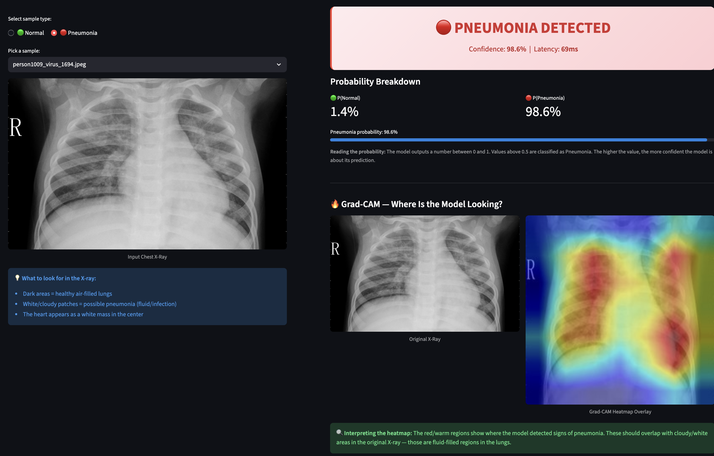
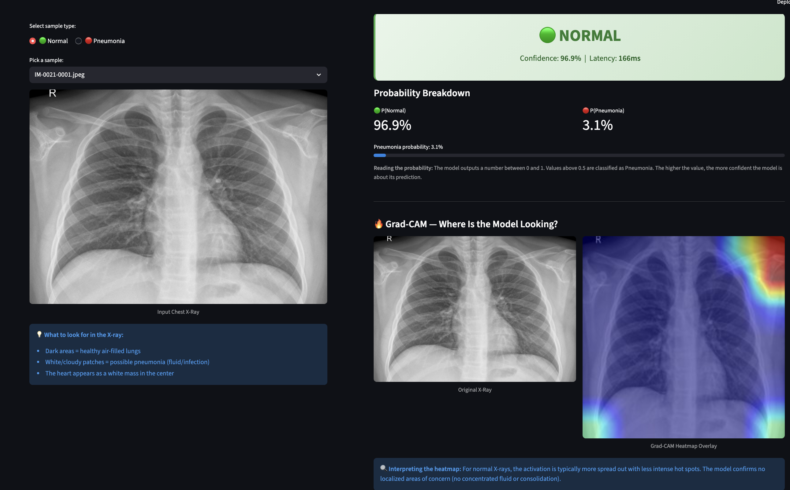
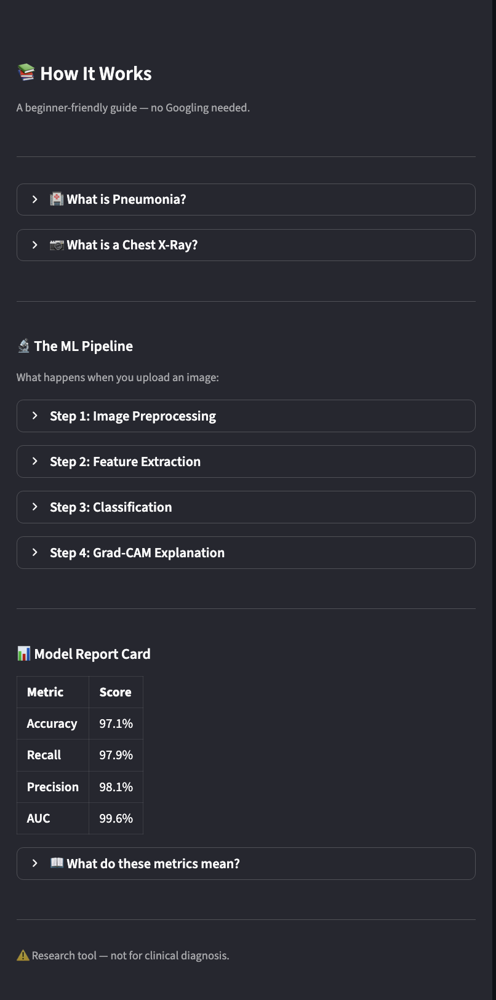

# 🫁 Pneumonia Detection from Chest X-Rays

     

An end-to-end Machine Learning system that classifies chest X-ray images as **Normal** or **Pneumonia** with visual explanations (Grad-CAM heatmaps), a REST API, and an interactive demo UI.

> **🎓 Beginner-friendly**: This README explains every concept from scratch — no prior ML or medical knowledge required.

---

## 📋 Table of Contents

- [What Does This Project Do?](#-what-does-this-project-do)
- [Demo](#-demo)
- [Background Knowledge](#-background-knowledge)
- [Model Performance](#-model-performance)
- [Project Structure](#-project-structure)
- [Quick Start](#-quick-start)
- [How the ML Pipeline Works](#-how-the-ml-pipeline-works)
- [Understanding the Results](#-understanding-the-results)
- [Key Design Decisions](#-key-design-decisions)
- [Tech Stack](#-tech-stack)
- [API Usage](#-api-usage)
- [Docker Deployment](#-docker-deployment)
- [Testing](#-testing)
- [Future Enhancements](#-future-enhancements)
- [Author](#-author)

---

## 🎯 What Does This Project Do?

This project takes a **chest X-ray image** as input and:

1. **Classifies** it as either **Normal** (healthy lungs) or **Pneumonia** (infected lungs)
2. **Explains** the prediction by highlighting which parts of the X-ray the model focused on (using Grad-CAM heatmaps)
3. **Serves** predictions through a REST API and an interactive web demo

Think of it as an AI assistant for radiologists — it can quickly flag suspicious X-rays for priority review.

---

## 🖥️ Demo

### Pneumonia Detected

Upload a chest X-ray with pneumonia → the model flags it with high confidence and shows a Grad-CAM heatmap highlighting the infected lung regions.



### Normal Lungs

Upload a healthy chest X-ray → the model correctly identifies it as Normal with high confidence. The Grad-CAM heatmap shows no concentrated areas of concern.



### Educational Sidebar

The built-in sidebar explains every step of the pipeline — from what pneumonia is, to how the neural network processes images, to how to read Grad-CAM heatmaps. No Googling required.



### Try It Yourself

```bash
# Start the interactive demo
streamlit run ui/demo_streamlit.py
# → Opens at http://localhost:8501
```

**Features:**
- 📤 Upload your own chest X-ray (JPEG/PNG)
- 🎯 One-click sample images (Normal and Pneumonia from the test set)
- 🔴🟢 Color-coded result cards with confidence scores
- 🔥 Side-by-side Grad-CAM heatmap comparison
- 📊 Probability breakdown with visual progress bar
- 📚 Built-in educational guide (sidebar) — beginner-friendly explanations for every step
- ⚡ Real-time pipeline status indicator

> **📸 Screenshot instructions:** The images above are placeholders. To add your own screenshots:
> 1. Run the demo: `streamlit run ui/demo_streamlit.py`
> 2. Take screenshots of Normal prediction, Pneumonia prediction, and the sidebar
> 3. Save them to `assets/demo_normal.png`, `assets/demo_pneumonia.png`, `assets/demo_sidebar.png`
> 4. Commit and push — the README will render them automatically

---

## 🧠 Background Knowledge

### What is Pneumonia?

**Pneumonia** is a lung infection that causes the air sacs (alveoli) to fill with fluid or pus. This makes breathing difficult and can be life-threatening, especially for children and the elderly.

**How doctors detect it:**
- A **chest X-ray** is the primary diagnostic tool
- Pneumonia appears as **white/cloudy patches** (called "opacities" or "consolidation") in the lung areas
- **Normal lungs** appear **dark** on X-rays because air doesn't block X-ray beams

### What is a Chest X-Ray?

A chest X-ray (CXR) is essentially a shadow photograph of your chest:

| Area | Appears As | Why |
|------|-----------|-----|
| **Air** (healthy lungs) | Dark/black | Air doesn't block X-rays |
| **Bone** (ribs, spine) | Bright white | Dense tissue blocks X-rays |
| **Heart** | White mass (center) | Muscle tissue is dense |
| **Fluid/infection** | Hazy white patches | Fluid blocks X-rays like tissue does |

### What is Machine Learning?

**Machine Learning (ML)** is teaching a computer to recognize patterns by showing it thousands of examples. In this project:

- We showed the model **5,856 chest X-rays** labeled as "Normal" or "Pneumonia"
- The model learned to distinguish the visual patterns that indicate pneumonia
- Now it can predict on **new, unseen X-rays** it has never encountered before

### What is Transfer Learning?

Instead of training a model from scratch (which would need millions of images), we start with a model that already knows how to see. **EfficientNet-B0** was pre-trained on **ImageNet** (14 million everyday photos — cats, dogs, cars, etc.). It already understands edges, textures, and shapes. We **fine-tuned** it on X-rays — teaching it to apply its existing vision skills to a medical context.

**Analogy:** It's like hiring a professional photographer (who understands composition and light) and training them to read X-rays. They learn faster than someone with no visual experience.

---

## 📊 Model Performance

All targets exceeded on the held-out test set (586 images the model never saw during training):

| Metric | Target | Achieved | Status |
|--------|--------|----------|--------|
| **Accuracy** | ≥ 92% | **97.10%** | ✅ |
| **Recall** (Pneumonia) | ≥ 95% | **97.90%** | ✅ |
| **Precision** | ≥ 85% | **98.13%** | ✅ |
| **F1 Score** | — | **98.01%** | ✅ |
| **ROC-AUC** | ≥ 0.96 | **99.58%** | ✅ |

### What Do These Metrics Mean?

| Metric | Plain English |
|--------|--------------|
| **Accuracy** (97.1%) | Out of every 100 X-rays, the model gets ~97 right |
| **Recall** (97.9%) | Out of every 100 actual pneumonia cases, the model catches ~98. This is the most critical metric — **missing pneumonia is dangerous** |
| **Precision** (98.1%) | Out of every 100 X-rays the model flags as pneumonia, ~98 actually have it. Few false alarms |
| **F1 Score** (98.0%) | The harmonic mean of precision and recall — a balanced measure of accuracy |
| **ROC-AUC** (99.6%) | How well the model separates the two classes across all possible thresholds. 1.0 = perfect, 0.5 = random coin flip. **0.996 is excellent** |

### Classification Report

```
              precision    recall  f1-score   support

      NORMAL       0.94      0.95      0.95       158
   PNEUMONIA       0.98      0.98      0.98       428

    accuracy                           0.97       586
   macro avg       0.96      0.96      0.96       586
weighted avg       0.97      0.97      0.97       586
```

### Test Suite

```
24/24 tests passed ✅ (model, dataset, augmentation, Grad-CAM, API)
```

---

## 📁 Project Structure

```
pneumonia-detection/
├── configs/                  # Configuration files (YAML)
│   ├── train_config.yaml     # Training hyperparameters
│   └── inference_config.yaml # Serving settings
│
├── src/pneumonia/            # Core ML library
│   ├── data/                 # Data loading & augmentation
│   │   ├── augmentation.py   # Image transforms (resize, flip, normalize)
│   │   ├── dataset.py        # PyTorch Dataset + DataLoader factory
│   │   └── split.py          # Stratified train/val/test splitting
│   ├── model/                # Neural network & explainability
│   │   ├── classifier.py     # EfficientNet-B0 + custom classification head
│   │   └── gradcam.py        # Grad-CAM heatmap generation
│   ├── training/             # Training pipeline
│   │   ├── trainer.py        # Two-phase training loop + MLflow logging
│   │   ├── evaluator.py      # Metrics, confusion matrix, ROC curve
│   │   └── callbacks.py      # Early stopping + model checkpointing
│   ├── inference/            # Prediction pipeline
│   │   └── predictor.py      # Single & batch inference with Grad-CAM
│   └── utils/                # Shared utilities
│       ├── config.py         # YAML config loader (Pydantic validation)
│       └── logging.py        # Structured logging
│
├── api/                      # REST API (FastAPI)
│   ├── app.py                # FastAPI app with model loading
│   ├── routes.py             # /predict, /batch, /health endpoints
│   └── schemas.py            # Request/response Pydantic models
│
├── ui/                       # Demo interface
│   └── demo_streamlit.py     # Interactive Streamlit UI with educational guide
│
├── tests/                    # Test suite (pytest)
│   ├── conftest.py           # Shared fixtures
│   ├── test_model.py         # 9 model architecture tests
│   ├── test_dataset.py       # 7 data pipeline tests
│   ├── test_gradcam.py       # 3 explainability tests
│   └── test_api.py           # 6 API endpoint tests (24 total ✅)
│
├── notebooks/                # Jupyter notebooks
│   ├── 01_eda.ipynb          # Exploratory Data Analysis
│   ├── 02_training.ipynb     # Training curve visualization
│   └── 03_evaluation.ipynb   # Error analysis + Grad-CAM deep dive
│
├── scripts/                  # CLI utilities
│   ├── download_data.sh      # Kaggle dataset download
│   ├── split_data.py         # Stratified re-splitting
│   └── export_onnx.py        # ONNX model export
│
├── pyproject.toml            # Dependencies, tool config, metadata
├── Makefile                  # Task orchestration (18 commands)
├── Dockerfile                # Multi-stage Docker build
├── docker-compose.yml        # API + Demo services
├── .github/workflows/ci.yml  # GitHub Actions CI pipeline
└── README.md                 # You are here
```

---

## 🚀 Quick Start

### Prerequisites

- **Python 3.9+** (check with `python3 --version`)
- **pip** (latest version recommended: `pip install --upgrade pip`)
- **~2 GB disk space** for dependencies (PyTorch, etc.)
- **~1.2 GB** for the dataset

### 1. Clone & Set Up

```bash
git clone https://github.com/Duanshi-B-Shah/pneumonia-detection.git
cd pneumonia-detection

# Create a virtual environment (isolates dependencies)
python3 -m venv .venv
source .venv/bin/activate

# Install all dependencies
pip install --upgrade pip
pip install -e ".[all]"
```

> **What is a virtual environment?** It's an isolated Python installation so this project's packages don't interfere with your other projects. The `.venv` folder contains everything. To exit: `deactivate`. To re-enter: `source .venv/bin/activate`.

### 2. Download the Dataset

**Option A — Kaggle API:**
```bash
pip install kaggle
# Set up credentials: https://www.kaggle.com/settings → API → Create New Token
mkdir -p ~/.kaggle
# Create ~/.kaggle/kaggle.json with {"username":"YOUR_USERNAME","key":"YOUR_TOKEN"}
chmod 600 ~/.kaggle/kaggle.json

make download
```

**Option B — Manual download:**
1. Go to [kaggle.com/datasets/paultimothymooney/chest-xray-pneumonia](https://www.kaggle.com/datasets/paultimothymooney/chest-xray-pneumonia)
2. Click **Download**, unzip, and move:
```bash
unzip ~/Downloads/archive.zip -d data/raw/
```

### 3. Re-split the Dataset

The original Kaggle dataset has a validation set of only **16 images** — statistically useless. We re-split properly:

```bash
make split
# Creates stratified 80/10/10 split:
#   train: 4,684 images (73% pneumonia, 27% normal)
#   val:     586 images
#   test:    586 images
```

> **What is stratified splitting?** It ensures each split has the same ratio of Normal to Pneumonia images. Without this, you might accidentally put all the Normal cases in the test set.

### 4. Train the Model

```bash
make train
```

This runs the two-phase training pipeline (~20-30 min on Apple M-series, ~10-15 min on GPU):

| Phase | Epochs | What Happens |
|-------|--------|-------------|
| **Phase 1** (Frozen) | 5 | Only the classification head trains. The backbone (EfficientNet) is locked — we're just teaching the new head to use the existing features |
| **Phase 2** (Fine-tune) | 15 | Everything unlocks. The entire network adapts to X-ray patterns |

The best model auto-saves to `checkpoints/best_model.pth` whenever validation recall improves.

### 5. Evaluate

```bash
make eval
```

Prints the classification report and generates:
- `evaluation/confusion_matrix.png`
- `evaluation/roc_curve.png`

### 6. Launch the Demo

```bash
streamlit run ui/demo_streamlit.py
# → Opens at http://localhost:8501
```

Upload any chest X-ray → get instant prediction + Grad-CAM heatmap + educational explanations.

### 7. Run Tests

```bash
make test
# 24/24 passed ✅
```

### Makefile Cheat Sheet

| Command | What It Does |
|---------|-------------|
| `make setup` | Install all dependencies |
| `make download` | Download Kaggle dataset |
| `make split` | Stratified 80/10/10 re-split |
| `make train` | Full training pipeline |
| `make eval` | Test set evaluation |
| `make serve` | FastAPI server (http://localhost:8000) |
| `make demo` | Streamlit demo (http://localhost:8501) |
| `make export-onnx` | Convert to ONNX format |
| `make test` | Run pytest suite |
| `make lint` | Ruff lint check |
| `make format` | Auto-fix formatting |
| `make docker` | Build Docker image |

---

## 🔬 How the ML Pipeline Works

Here's what happens when you feed an X-ray into the model:

### Step 1: Preprocessing

The raw X-ray image is prepared for the model:

- **Resize** to 224×224 pixels (the model's fixed input size)
- **Convert** to RGB (3 channels), even though X-rays are grayscale
- **Normalize** pixel values to match ImageNet statistics

> **Why normalize?** The model was pre-trained on ImageNet photos with specific brightness/contrast ranges. Normalizing X-rays to the same range helps the model apply what it already learned.

### Step 2: Feature Extraction (EfficientNet-B0)

The image passes through the neural network's convolutional layers:

- **Early layers** detect simple patterns: edges, lines, textures
- **Middle layers** combine these into shapes: curves, blobs, boundaries
- **Deep layers** recognize complex structures: lung boundaries, rib patterns, fluid patches

The output is a **feature vector** of 1,280 numbers — a compressed representation of everything meaningful in the image.

### Step 3: Classification

A small classification head (2 layers) converts the 1,280 features into a single probability:

- **Close to 0.0** → Likely Normal
- **Close to 1.0** → Likely Pneumonia
- **Threshold = 0.5** — above this means pneumonia

### Step 4: Grad-CAM Explanation

**Grad-CAM** (Gradient-weighted Class Activation Mapping) creates a heatmap showing which image regions influenced the prediction:

- 🔴 **Red** = The model focused heavily here
- 🔵 **Blue** = The model ignored this area
- For a good pneumonia prediction, red areas should overlap with the cloudy lung patches

> **Why this matters:** In healthcare, "black box" predictions are not acceptable. Doctors need to verify the AI is looking at the right thing — not making decisions based on image artifacts (like a hospital logo in the corner).

---

## 📈 Understanding the Results

### Confusion Matrix

```
                 Predicted
                Normal  Pneumonia
Actual Normal    150       8        ← 8 false alarms (False Positives)
      Pneumonia    9     419        ← 9 missed cases (False Negatives)
```

- **False Positives (8)**: Healthy patients flagged as pneumonia → unnecessary follow-up tests
- **False Negatives (9)**: Pneumonia patients missed → **this is the critical error we minimize**

### Why Recall Matters Most

In medical diagnosis, **missing a disease is worse than a false alarm**:

- A false positive leads to an extra test → mild inconvenience
- A false negative means untreated pneumonia → potentially fatal

That's why we optimize for **recall** (97.9%) — catching as many true cases as possible.

---

## 🎯 Key Design Decisions

| Decision | Why |
|----------|-----|
| **EfficientNet-B0** (not ResNet/VGG) | Best accuracy-to-size ratio. Only 4M parameters → fast CPU inference |
| **Two-phase training** | Phase 1 prevents catastrophic forgetting of pre-trained features. Phase 2 allows domain adaptation |
| **Weighted BCE loss** | Handles the 73/27 class imbalance without oversampling |
| **Stratified re-split** | Original val set had only 16 images — unusable for reliable metrics |
| **YAML configs** (not hardcoded) | Change hyperparameters without editing Python code. MLflow logs full config per run |
| **Makefile** orchestration | 18 complex commands → simple `make train`, `make test`, `make demo` |
| **Grad-CAM** (not just predictions) | Clinical trust requires visual explanations. Doctors verify the model looks at lung regions |
| **Recall ≥ 95% target** | In medicine, false negatives are more dangerous than false positives |

---

## 🛠️ Tech Stack

| Layer | Technology | What It Does |
|-------|-----------|-------------|
| **Deep Learning** | PyTorch 2.x, torchvision | Core neural network training and inference |
| **Model Architecture** | timm (EfficientNet-B0) | Pre-trained image classification backbone |
| **Interpretability** | pytorch-grad-cam | Visual explanations (heatmap overlays) |
| **Experiment Tracking** | MLflow | Logs hyperparams, metrics, and models per training run |
| **API** | FastAPI + Uvicorn | REST API for serving predictions |
| **Demo UI** | Streamlit | Interactive web demo with educational guide |
| **Config** | Pydantic + PyYAML | Type-safe configuration loading |
| **Testing** | pytest + pytest-cov | 24 unit tests with coverage reporting |
| **Linting** | Ruff | Fast Python linter and formatter |
| **CI/CD** | GitHub Actions | Lint → Test → Docker build on every push |
| **Containerization** | Docker + docker-compose | Reproducible deployment |
| **Model Export** | ONNX Runtime | Optimized inference for production |

---

## 🌐 API Usage

### Start the Server

```bash
make serve
# → http://localhost:8000/docs (Swagger UI)
```

### Single Prediction

```bash
curl -X POST http://localhost:8000/api/v1/predict \
  -F "file=@path/to/xray.jpg"
```

**Response:**
```json
{
  "label": "PNEUMONIA",
  "confidence": 0.9421,
  "probability_pneumonia": 0.9421,
  "class_index": 1,
  "latency_ms": 123.4,
  "gradcam_url": "/static/gradcam/abc123.png"
}
```

### Health Check

```bash
curl http://localhost:8000/api/v1/health
# {"status": "healthy", "model_loaded": true, "version": "0.1.0"}
```

### Batch Prediction

```bash
curl -X POST http://localhost:8000/api/v1/batch \
  -F "files=@xray1.jpg" \
  -F "files=@xray2.jpg"
```

---

## 🐳 Docker Deployment

```bash
make docker       # Build image
make docker-run   # Start API (port 8000) + Demo (port 8501)
make docker-stop  # Tear down
```

---

## 🧪 Testing

```bash
make test    # Run all 24 tests with coverage
make lint    # Ruff linting + format check
make format  # Auto-fix formatting issues
```

**Test coverage by module:**

| Module | Coverage | What's Tested |
|--------|----------|--------------|
| `gradcam.py` | 100% | Heatmap generation, overlay saving, dimension validation |
| `augmentation.py` | 85% | Transform pipelines, output shapes, determinism |
| `classifier.py` | 82% | Forward pass, freeze/unfreeze, param count, target layer |
| `config.py` | 81% | YAML loading, Pydantic validation, device detection |
| `dataset.py` | 80% | Data loading, class weights, sampler, error handling |
| `api (routes)` | 100% | Health check, 503 handling, schema validation |

---

## 🔮 Future Enhancements

- **Multi-class**: Extend to Bacterial vs. Viral Pneumonia vs. Normal (3-class)
- **Model ensemble**: Combine EfficientNet + ResNet + DenseNet for higher accuracy
- **DICOM support**: Accept raw medical imaging format (not just JPEG/PNG)
- **ONNX inference**: Export to ONNX for <100ms CPU inference
- **Active learning**: Flag low-confidence predictions for radiologist review
- **SageMaker deployment**: Serverless endpoint for scalable cloud inference

---

## 👤 Author

**Duanshi Shah**

- 🎓 Georgia Tech MSCS (Machine Learning) — Expected Dec 2026
- 💼 SDE I @ Amazon
- 🔗 [GitHub](https://github.com/Duanshi-B-Shah) · [LinkedIn](https://linkedin.com/in/duanshi-shah)

---

## 📜 License

MIT — see [LICENSE](LICENSE) for details.

---

> *"The best debugging starts before the code is written."* — Built with a spec-first approach: requirements → design → implementation.
